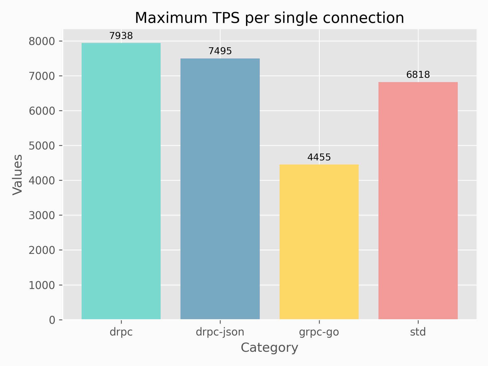
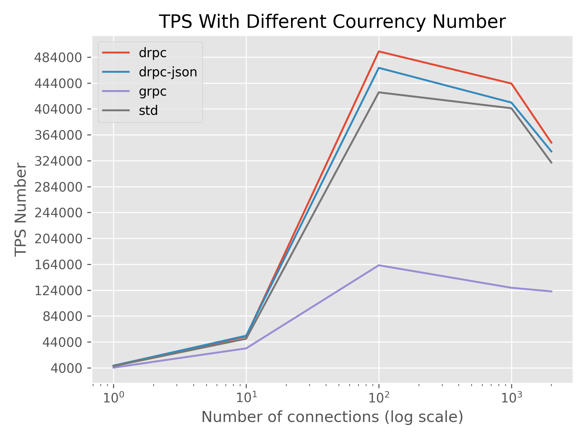

# dgen

## 简介

drpc 是一个类似于grpc的跨语言RPC框架，dgen是其编译器部分。

本项目设计了一种简单的中立接口描述语言(IDL)，用户可以通过dgen从IDL生成目标语言的桩代码，并与drpc框架的接口进行对接。


## IDL 语法

IDL 语法类似于Protobuf，但更为简单。只包含四个关键字:

+ `enum`：用于定义枚举类型
+ `message`：用于定义复合类型
+ `service`: 用于定义服务集合
+ `optional`: 用于定义message的成员为可选（即该成员值可以为空），注：message中每个成员默认是必选的。

**基础类型**：`uint8`、`uint16`、`uint32`、`uint64`、`int8`、`int16`、`int32`、`int64`、`string`

**示例**
```protobuf
# comment
enum fruit {
    apple,
    banana
}

message HelloRequest {
    seq=1 string name;
}

message HelloResponse {
    seq=1 string name;
    optional seq=2 string reply;
}

service Greeter {
    SayHello(HelloRequest) return (HelloResponse);
    OrderFruit(fruit);
}
```

## 安装方法
**从源码编译安装**：
```
git clone https://github.com/fengluodb/dgen.git
cd dgen
sh build.sh
```
即可生成名为dgen的可执行文件。

## 使用方法
```
Usage of dgen:
    -e string 
        the serialization method of message (default "", represent adopt the project's default serialization method, optional "json")
    -f string
        the path of IDL file
    -o string
    	the dirpath where the generated source code files will be placed (default ".")
    -l string
    	the target languege the IDL will be compliled
```

## 压测
除了对比default编码和json编码外，还引入了golang的rpc标准库和grpc-go框架来进行横向的对比.

测试案例选择简单的Add服务(两数相加)
```protobuf
message MathRequest {
    seq=1 int32 A;
    seq=2 int32 B;
}

message MathReply {
    seq=1 int32 C;
}

service Math {
    Add(MathRequest) return (MathReply);
}
```

> 所有测试在两台配置相同的主机上进行，一台作为服务端，一台作为客户端。采用reply-response同步请求方式，在未获取请求的响应之前，不允许再发送下一个请求。所有案例测试多次，取平均值。

测试环境：
+ 系统：Ubuntu 20.04
+ 终端利用 `ulimit -n 65535` 命令，将允许打开的文件描述符改为最大
+ CPU：Intel i5-10500f
+ 内存：32GB

### 单用户单连接
不同框架在单用户单连接下的最大吞吐率：


### 单用户多连接
不同框架在不同并发客户端数据下的吞吐率, 每个连接发送1000个请求：

